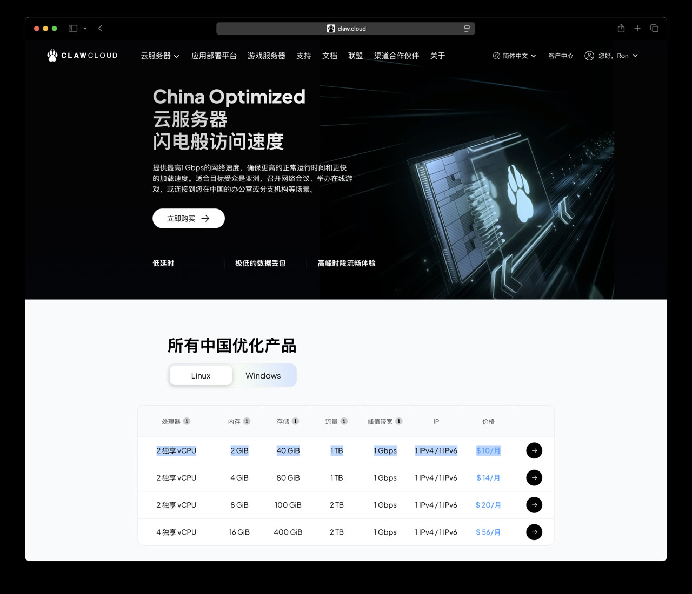
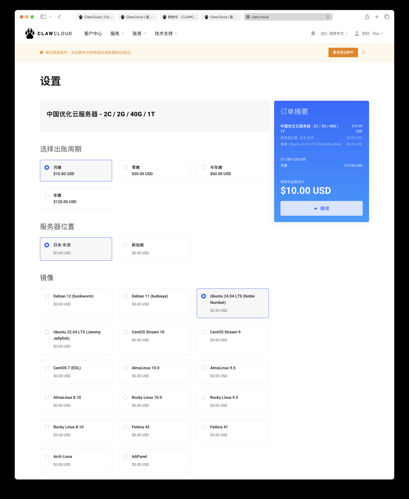
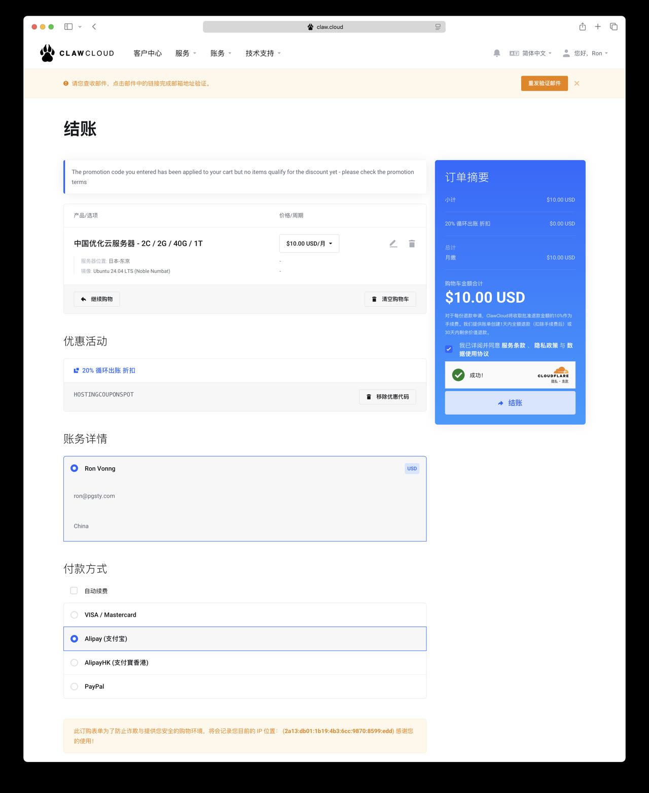
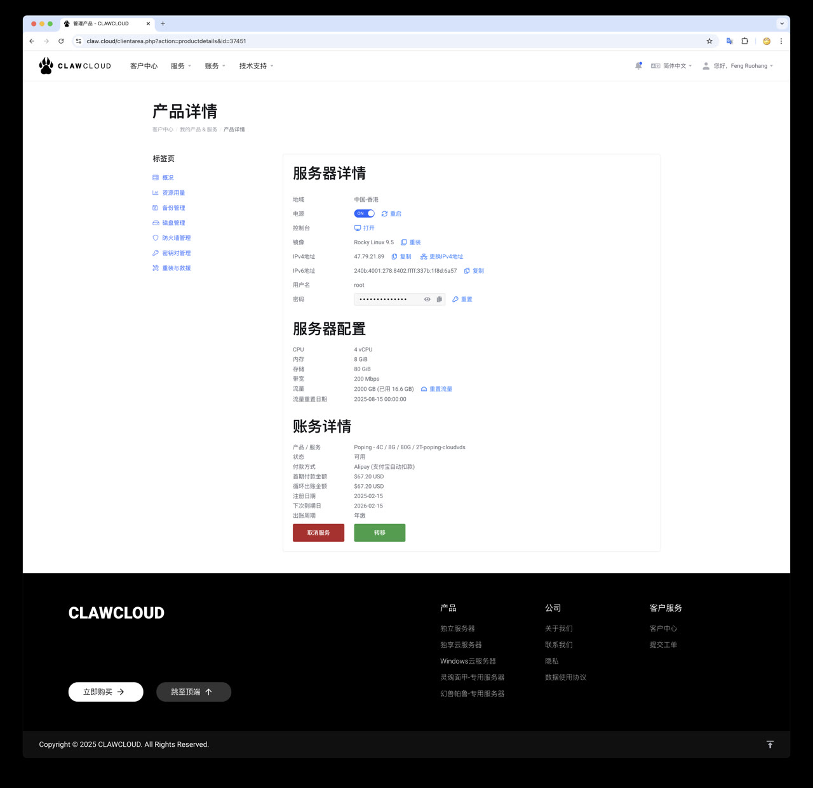

本文介绍如何在 ClawCloud 上搞一台高性价比的云服务器，作为 PostgreSQL 的学习环境。


## 为什么是阿爪云

你只要有任何一台 Linux 服务器，可以 ssh 登上去就行，至于你用 AWS，阿里云，腾讯云，或者什么 XX 云都无所谓。
当然那些云光注册申请就要折腾半天，还不如阿里云青春版的 ClawCloud 来的简单，所以这里就用它作为例子了。

选择云服务器，建议用2c2g 或者 2c4g 的配置，主要是得有个公网 IP，以及足够的带宽，带宽和延迟直接影响你的使用体验。
国内云厂商的那些 1M / 3M / 5M 乞丐带宽纯属垃圾，不过阿里云倒是有个峰值 200 Mbps 的轻量应用服务器可以一战，活动价能到 ¥38/一年。

不过阿抓云自带科学上网，而且给的是 1Gbps 的峰值带宽（晚高峰的时候就比较难看，但平时速度还是很不错的）。
老冯对初学者的的建议是，要是没活动，就先整个按月付费的阿爪云用着， 等到 618 ，双十一双十二有活动机器了再买个便宜包年款（记得买香港/东京区域的！）。

这个 VPS 还可以用来建站，你还可以用它来使用 ChatGPT，Claude Code ，访问国外软件仓库等等， 当然这个老冯可没办法教你，教了这个教程就没了！


## 快速上手

访问 https://claw.cloud ，注册一个账号， 注册后需要验证邮箱。当然你也可以直接用 GitHub 或者 Google 账号登陆。


首页上选择 “云服务器” -> “China Optimized”，然后挑一台。



老冯建议买这个最便宜的 2vCPU 2GB 40GB 的机器就可以，十美元一个月。
活动价有时候有 50% 的折扣，反正没几个钱，先弄一个用着。

## 挑选

出账周期选择月缴，服务器位置选择东京，操作系统镜像建议选择 Ubuntu 24.04 （或者 RockyLinux 9.5）。



注意不要买错了，要买中国优化的云服务器，不然延迟会很高。


## 结账

结账之前，不要忘了去 Google 上搜一个 [ClawCloud Coupon Codes](https://www.couponcode.in/clawcloud/?open=197976):



这不，老冯结账之前搜了一下，还有个 20% 的循环折扣码，输入后就能打八折。赶上活动了有 50% 折扣。
然后支付宝付款就可以了！


## 查看你的 VPS

然后你可以在服务器详情页面看到你的 VPS IP 地址，用户名和密码。



接下来，你需要用任何你喜欢的 ssh 客户度连接到这台 VPS 上去。

```bash
ssh root@ip     # 然后输入密码
```

恭喜，你已经成功拥有了你自己的 VPS！接下来，你可以用它干很多事情了。


## 接下来干什么？

建站，跑数据库，进行数据分析，运行可视化软件，分享你的作品，甚至是科学上网，等等。

当然， 有了服务器，通常来说你还要搭配一个域名来使用，这个倒不是必须的，但有了会方便很多。

你应该把这里的服务器公网 IP 地址记录下来，然后再 Cloudflare 里把你的域名解析到这台服务器上。

关于这个主题，请参考下一章： [Cloudflare 新手指南](/ch1/cloudfalre)。


## 小结

本教程介绍了如何在 ClawCloud 上创建一台 Ubuntu 24.04 的云服务器。


