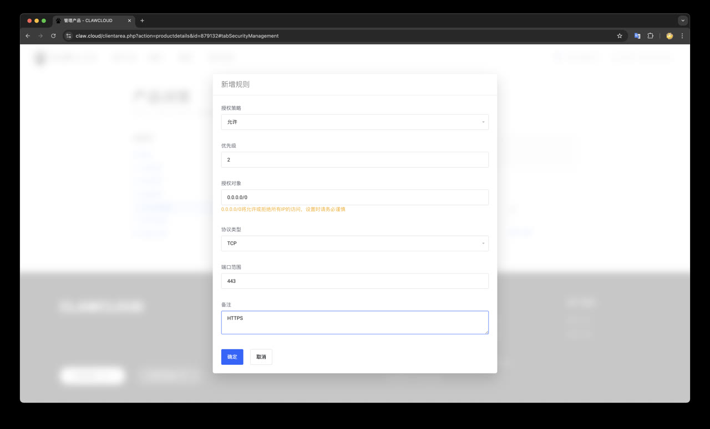
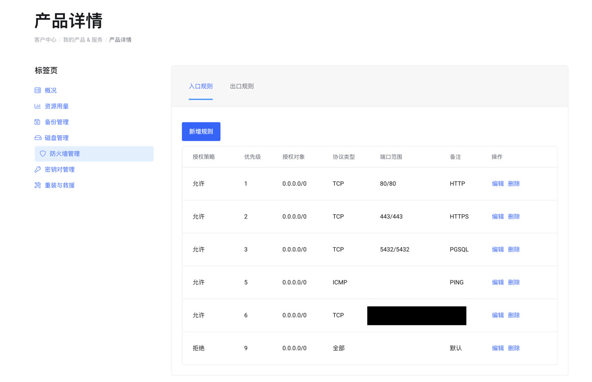

本文介绍如何在 ClawCloud 上搞一台高性价比的云服务器，作为 PostgreSQL 的学习环境。


## 为什么是阿爪云

你只要有任何一台 Linux 服务器，可以 ssh 登上去就行，至于你用 AWS，阿里云，腾讯云，或者什么 XX 云都无所谓。
当然那些云光注册申请就要折腾半天，还不如阿里云青春版的 ClawCloud 来的简单，所以这里就用它作为例子了。

选择云服务器，建议用2c2g 或者 2c4g 的配置，主要是得有个公网 IP，以及足够的带宽，带宽和延迟直接影响你的使用体验。
阿爪云自带科学上网，而且峰值带宽 1Gbps （晚高峰的时候就比较一般，但平时速度还是很不错的）。

老冯对初学者的的建议是，要是没活动，就先整个按月付费的阿爪云用着， 等到有活动价了再买个便宜包年款。
这个 VPS 还可以用来建站，你还可以用它来使用 ChatGPT，Claude Code ，访问国外软件仓库等等， 当然这个老冯可没办法公开教你！


## 快速上手

访问 https://claw.cloud ，注册一个账号， 注册后需要验证邮箱。当然你也可以直接用 GitHub 或者 Google 账号登陆。


首页上选择 “云服务器” -> “China Optimized”，然后挑一台。


老冯建议买这个最便宜的 2vCPU 2GB 40GB 的机器就可以，十美元一个月，活动价有时候有 50% 的折扣。

## 挑选

出账周期选择月缴，服务器位置选择东京，操作系统镜像建议选择 Ubuntu 24.04 （或者 RockyLinux 9.5）。


注意不要买错了，要买 **中国优化的云服务器**，不然延迟会很高。


## 结账

结账之前，不要忘了去 Google 上搜一个 [ClawCloud Coupon Codes](https://www.couponcode.in/clawcloud/?open=197976) 优惠券：


这不，白给的 20% 的循环折扣码，输入后就能打八折，然后支付宝付款就可以了！


## 查看你的 VPS

然后你可以在服务器详情页面看到你的 VPS IP 地址，用户名和密码。


接下来，你需要用任何你喜欢的 ssh 客户度连接到这台 VPS 上去。

```bash
ssh root@ip     # 然后输入密码
```

恭喜，你已经成功拥有了你自己的 VPS！接下来，你可以用它干很多事情了。


## 接下来干什么？

建站，跑数据库，进行数据分析，运行可视化软件，分享你的作品，甚至是科学上网，等等。

当然， 有了服务器，通常来说你还要搭配一个域名来使用，这个倒不是必须的，但有了会方便很多。

你应该把这里的服务器公网 IP 地址记录下来，然后再 Cloudflare 里把你的域名解析到这台服务器上。

关于这个主题，请参考下一章： [Cloudflare 新手指南](/ch1/cloudfalre)。


## 插播一下安全提示

为了避免你的服务器被黑了又来怪老冯，这里插播一下基本安全加固知识。
对初学者来说，这个事儿倒是不着急，反正记得重要数据做好备份 —— 然后你要是瞎搞被黑了，大不了点一下 “重装系统” 就可以了。

你可以用各家云厂商自带的防火墙配置工具，只允许访问特定的端口。



> 在 ClawCloud 上添加防火墙规则，0.0.0.0/0 意味着对全体来访者生效

新手上路的话，你就记住开这几个端口就行了：

- TCP 22 : SSH 访问
- TCP 80 : HTTP 访问
- TCP 443 : HTTPS 访问
- TCP 5432 : PostgreSQL 访问（这个看情况，一般不太建议开）
- ICMP : 允许 ping 服务器
- 保底规则：拒绝其他链接

> [!WARN] 数据库直接对公网开放端口会暴露额外的攻击面，你非要开的话切记一件事，把所有密码都改掉，而且要足够复杂。

这里如果你没有域名，准备通过 IP 端口直接访问各种 Web服务图形界面的话，可以把其他端口也打开，比如 TCP 3000，TCP 9090。
或者干脆就先不管防火墙，先把流程跑通了再回头来看。最后配置出来的防火墙规则大概是这个样子：



老冯的建议是，所有 Web UI 类服务统一从 80/443 通过 Nginx 统一代理访问，后面会介绍如何配置，但需要一个域名。

[Cloudflare 新手指南](/ch1/cloudfalre) 去弄个域名，你就可以在同一个端口上区分不同服务了！


## 关于阿爪云


有人问老冯，为什么不用 “阿里云”，”腾讯云“ 这些 ”知名大品牌“ 云啊，
这个老冯在 [云计算泥石流](https://vonng.com/cloud) 专栏里说过很多了 —— 第一贵，第二烂。
烂主要是烂在带宽上 —— 各种套餐默认 1～5Mbps 的带宽，基本上就是乞丐速度。

ClawCloud 小道消息称是阿里云开的马甲号，卖便宜 VPS，因为大号没法下来做这个生意。
之前有过性价比很好的香港服务器，不过赔本卖的太多跑路了，但是日本和新加坡区域还是有的。

老冯自己目前用的两台分别是：

- 4 vCPU / 16 GiB 内存 / 200 GiB 磁盘 / 流量 2000 GB / 带宽峰值 1Gbps / 每月 $18.0
- 4 vCPU / 8 GiB 内存  / 80 GiB 磁盘 / 流量 2000 GB / 带宽峰值 200 Mbps / 每年 $67.2

这个性价比直接拉爆，为什么这么说，你可以去阿里云 ECS 看一眼，
日本东京可用区，4c16g 机型200G乞丐云盘，看看价格，1081.75¥ 每月。
加上网络这个价格更离谱 —— 包带宽的最大 200 Mbps，每月十几万，
稍微理智一点的按流量计费，0.6 ¥/GB，两个TB 的流量也就是每月 1200 块钱 …… 


当然，你也要注意：

1. 只有中国优化网络的服务器才能有几十毫秒的延迟，像我那台普通的香港服务器上海访问就要 200ms 左右。
2. 中国网络优化的服务器，这里的带宽是峰值带宽，而且共享带宽，如果你长时间打满带宽就会触发限流（所以不要用来跑 P2P，或者下电影之类的东西）

- 社区观察到的现象是大概 40GiB 左右降速到 100Mbps，然后逐级开始降速，一段时间不再占用后会自动解除。
- https://lowendtalk.com/discussion/205280/beware-of-clawcloud-misleading-bandwidth-claims-and-terrible-support

如果你要刷流媒体，用 ChatGPT，ClaudeCode，更省时的办法是弄个便宜的 MonoCloud 作为备份路线。


