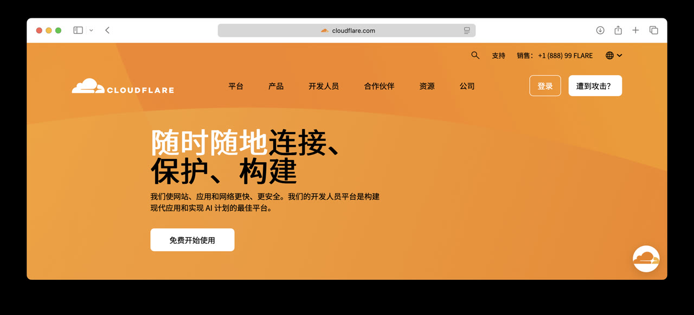
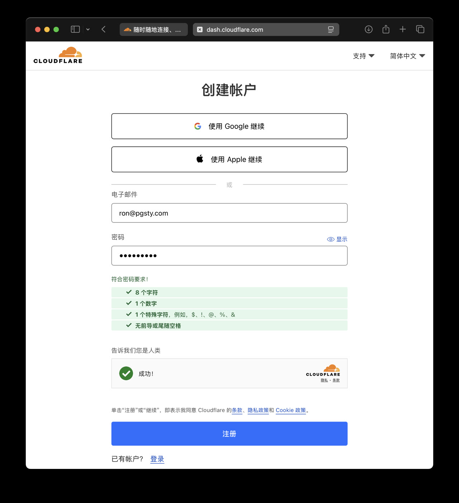
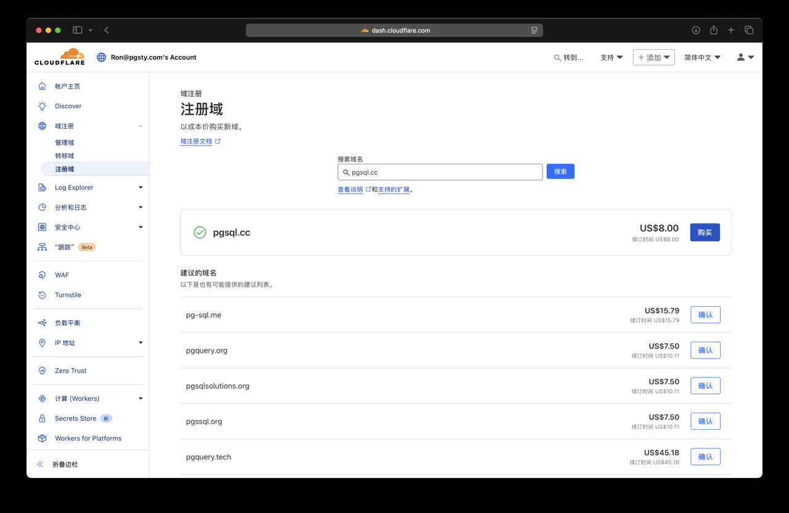
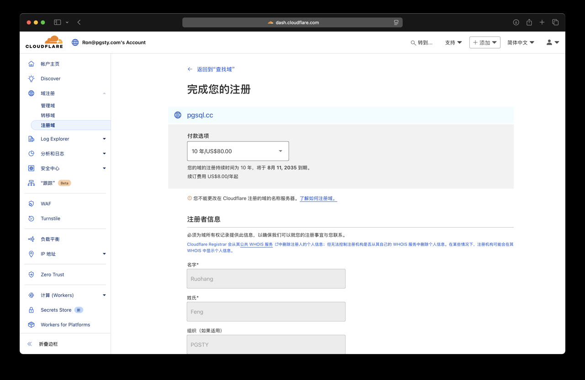
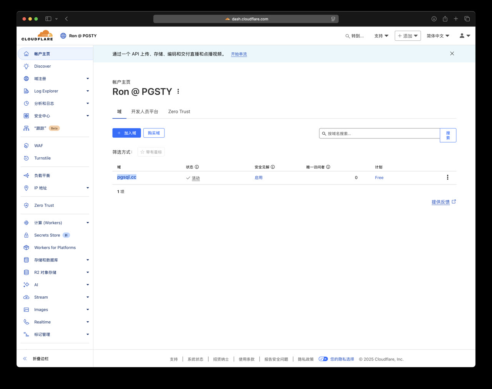
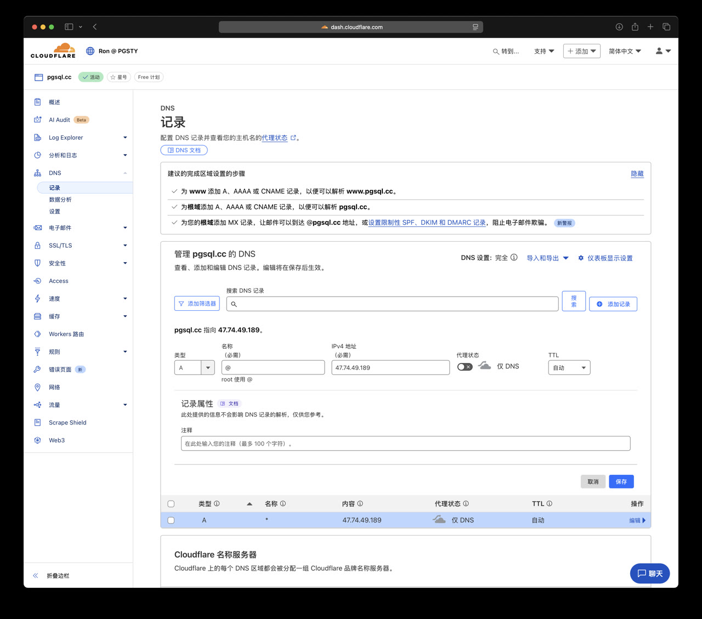

一个域名对于学习 PostgreSQL 来说并不是必须的，但它能在环境搭建和使用体验上带给你很大的便利。
而且这也算是互联网的基本技能之一，老冯建议最好去 Cloudflare 上搞个域名，30块钱一年，还要啥自行车。

## 为什么要在 Cloudflare 注册域名？

Cloudflare，人称赛博佛祖，提供了免费的全球 CDN 服务，免费 HTTPS 证书，免费的 WAF 防火墙，基本流量分析，机器人防护，抗 DDoS，还有免费的 10GB R2 对象存储，以及每天10万次的 Worker 请求，还有一键托管网站的 Pages！

而这些需要的不过是一个每年最低 $ 4.71 的域名，也就是人民币 33 块钱，基本约等于白送。唯一的门槛就是你得有个银行卡（VISA，MasterCard……），好消息是从 2025-07 开始，[也支持银联卡付款了！](https://developers.cloudflare.com/billing/billing-policy/#approved-payment-methods)

你只要有个邮箱，有个银行卡，每年掏 30 块钱，就可以享受赛博佛祖的贴身服务了，还等什么，发车了，老冯手把手带你注册一个！

## 注册

访问 [Cloudflare 中文版](https://www.cloudflare.com/zh-cn/) ，选择 “免费开始使用”。

你可以用邮箱注册一个 Cloudflare 账号，需要验证电子邮箱。

## 验证邮箱

验证电子邮箱后，要绑定银行卡或者信用卡，填写账单地址。

## 填写账单地址

当然要想买域名你还需要绑定付款方式，Cloudflare 支持多种付款方式，包括信用卡、借记卡和 PayPal，最近刚支持银联卡。

## 选购域名

你可以选一个心仪的域名，不过 Cloudflare 的域名搜索功能做的不太好，老冯建议你去阿里云的域名注册控制台搜索自己想要的域名，再回 Cloudflare 购买。

- [阿里云万网：域名注册](https://wanwang.aliyun.com/domain)

什么？你问我为啥不直接在阿里云注册？阿里云有上面这些牛逼免费服务么。

如果要买域名，我建议买个便宜的，这里有个 [Cloudflare 价格表](https://www.reddit.com/r/webdev/comments/17lpxa6/cloudflare_domain_registrar_pricing_table/?utm_source=chatgpt.com)。

| TLD      | Base Purchase Price | Base Renewal Price | ICANN Fee | Total First Year Price | Total Renewal Price | Average Annual Cost Over 5 Years |
|:---------|:--------------------|:-------------------|:----------|:-----------------------|:--------------------|:---------------------------------|
| co.uk    | $4.71               | $4.71              | $-        | $4.71                  | $4.71               | $4.71                            |
| me.uk    | $4.71               | $4.71              | $-        | $4.71                  | $4.71               | $4.71                            |
| org.uk   | $4.71               | $4.71              | $-        | $4.71                  | $4.71               | $4.71                            |
| uk       | $4.71               | $4.71              | $-        | $4.71                  | $4.71               | $4.71                            |
| bid      | $3.98               | $4.98              | $0.18     | $4.16                  | $5.16               | $4.96                            |
| download | $3.98               | $4.98              | $0.18     | $4.16                  | $5.16               | $4.96                            |
| date     | $3.98               | $4.98              | $0.18     | $4.16                  | $5.16               | $4.96                            |
| loan     | $3.98               | $4.98              | $0.18     | $4.16                  | $5.16               | $4.96                            |
| men      | $3.98               | $4.98              | $0.18     | $4.16                  | $5.16               | $4.96                            |
| party    | $3.98               | $4.98              | $0.18     | $4.16                  | $5.16               | $4.96                            |
| stream   | $3.98               | $4.98              | $0.18     | $4.16                  | $5.16               | $4.96                            |
| trade    | $3.98               | $4.98              | $0.18     | $4.16                  | $5.16               | $4.96                            |
| win      | $3.98               | $4.98              | $0.18     | $4.16                  | $5.16               | $4.96                            |
| rodeo    | $5.00               | $5.00              | $0.18     | $5.18                  | $5.18               | $5.18                            |
| work     | $6.00               | $6.00              | $0.18     | $6.18                  | $6.18               | $6.18                            |
| us       | $6.50               | $6.50              | $-        | $6.50                  | $6.50               | $6.50                            |
| casa     | $7.50               | $7.50              | $0.18     | $7.68                  | $7.68               | $7.68                            |
| com.co   | $8.00               | $8.00              | $-        | $8.00                  | $8.00               | $8.00                            |
| cc       | $8.00               | $8.00              | $-        | $8.00                  | $8.00               | $8.00                            |
| net.co   | $8.00               | $8.00              | $-        | $8.00                  | $8.00               | $8.00                            |
| nom.co   | $8.00               | $8.00              | $-        | $8.00                  | $8.00               | $8.00                            |
| boo      | $8.00               | $8.00              | $0.18     | $8.18                  | $8.18               | $8.18                            |
| page     | $8.00               | $8.00              | $0.18     | $8.18                  | $8.18               | $8.18                            |
| contact  | $9.00               | $9.00              | $0.18     | $9.18                  | $9.18               | $9.18                            |
| business | $9.00               | $9.00              | $0.18     | $9.18                  | $9.18               | $9.18                            |
| futbol   | $9.00               | $9.00              | $0.18     | $9.18                  | $9.18               | $9.18                            |
| pictures | $9.00               | $9.00              | $0.18     | $9.18                  | $9.18               | $9.18                            |
| observer | $9.00               | $9.00              | $0.18     | $9.18                  | $9.18               | $9.18                            |
| com      | $9.59               | $9.59              | $0.18     | $9.77                  | $9.77               | $9.77                            |
| net      | $9.92               | $9.92              | $0.18     | $10.10                 | $10.10              | $10.10                           |
| org      | $9.93               | $9.93              | $0.18     | $10.11                 | $10.11              | $10.11                           |
| club     | $9.95               | $9.95              | $0.18     | $10.13                 | $10.13              |                                  |

最便宜的一档是 `.uk`, `.co.uk`, `.me.uk`, `.org.uk` 这种英国 TLD 域名： `$4.71` / 年。

老冯觉得性价比比较好的是 `.cc`  域名，价格是 `$8.00` / 年。作为例子，我这次买了个 `pgsql.cc` 域名，用来演示。后面的例子你可以把这个占位域名换成你自己的域名。

## 结账

有一些域名域名首年的价格会比较便宜，续费的价格就贵了，你也可以最多一次性买十年的，不过一般也没那个必要。

## 解析

有了域名之后，你就可以开始添加解析了！从主页选中这个域名，然后点击左侧的 “DNS解析”，你就可以在这里添加解析记录了。

如果你按照之前的教程采购了一台云服务器，那么这里你就可以把你的域名解析到你的云服务器上了！

老冯建议你添加两条 A 记录：一条 `*` 记录，一条 `@` 记录，这样你访问 `pgsql.cc` 或者 `*.pgsql.cc` （任意子域名）都会解析到你的这台云服务器上。

你看，有个域名的好处就是，你明明只有一台云服务器，一个端口（80/443），但是可以通过不同域名来通过同一个 IP+端口 访问不同的 Web 服务！

## Pages 快速上手

Cloudflare 提供免费的静态网站托管服务，叫做 Cloudflare Pages。虽然 GitHub 也提供免费的 Pages，但是 Cloudflare Pages 的功能更强大。
例如，你可以给你的站点绑定多个域名，指定不同的分支部署多个版本。而使用体验上跟 GitHub Pages 一样丝滑。

> [!Note] TBD

## R2 快速上手

Cloudflare 送了 10GB 的 R2 对象存储空间，你可以用来干不少事情了。要知道这可是带全球 CDN 分发的免费存储，世界上（除了中国）任何地方下载你这里的东西都奇快无比！

R2 适合放一些软件包，大文件，图片，视频，你自己的软件仓库，数据集，备份等等。
但如果是静态网站，你就没必要放在这里，你可以直接用 Cloudflare Pages 来托管。

你可以使用 `rclone` 这样的软件来上传下载同步文件到 R2 对象存储中。

> [!Note] TBD

## Worker 快速上手

Cloudflare Workers 还可以作为一个轻量级代理。比如，当你想要访问 DockerHub 拉取镜像的时候，DockerHub 被墙了怎么办？

你可以 Fork 这个项目，然后发布到 Cloudflare，TADA，你就拥有一个 Docker 代理域名了。
你可以在 Docker 的 registry 中添加这个代理地址，加速下载。

> [!Note] TBD
